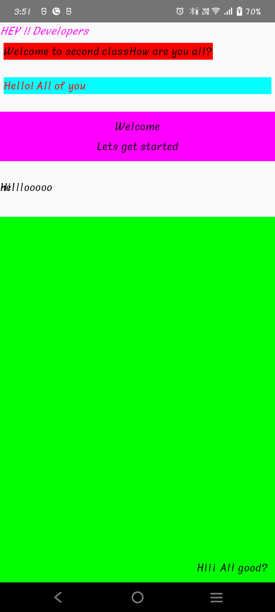

# android_studio
This contains code of app development
 
Day_1---july3
application on emulator and physical device
 

 
App Lifecycle
 
Text and its Modifier
 

 
Day_2---july 4
 
Layout with alignment and arrangement
 

 
Day_3----july 5
 
UI elements
 

 
Day_4----july 6
 
UI Elements continued
 

 
REPLICA
 

 
Day_5---july8
 
state management,navigation,list
 

 
Day_6---july9
 
MVVM implementation
